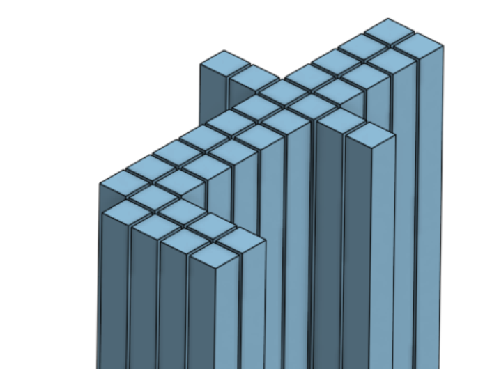

# Shape generation with a Reinforcement Learning agent

This notebook is an experiment with shape generation using fonts as datasets. (0-9 a-z A-Z)

I'm looking at ways to use AI to create design tools, where the AI would serve as a digital assistant during the design process. One problem is that computers and humans view design in very different ways, bridging that gap is one central part of AI research. Here I'm trying out an idea i had regarding this

    
We have seen Reinforcement models excel in deterministic environments, such as go, chess or atari games. What if you were to design a game that teach the agent a skill that is useful outside of the game environment?

    

In this game a blindfolded agent is dropped down on a letter, such as the letter "t" above, allthough the agent doesn't know which letter. The agent then explores the unknown world, pixel by pixel, getting rewarded for picking a safe pixel.

By training our agent we will end up with a model that inputs the current state (the environment known by the agent), and outputs a probability map for the next move.

    
What would happen if the trained agent is dropped down on a big open plane? <b>Will it still move in the shape of letters?</b>

